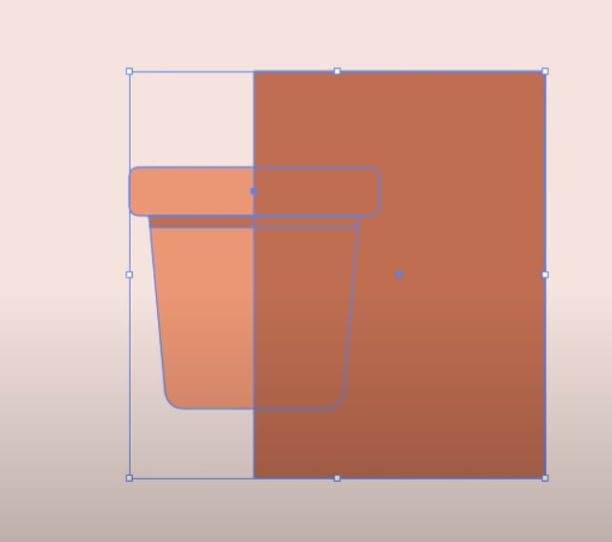

# Co je Illustrator a k čemu je nám dobrý?

## Začínáme

Nejprve si vytvoříme nový soubor - plátno - o velikosti 1920 x 1080 px.

Vytvoříme si čtverec (začneme květináčem).

Upravíme si u něj barevnost.

Panel s barvami si můžeme v illustrátoru připnout.

Čtverec si zduplikujeme a zmenšíme, abychom měli připraveno pro okraj květináče.

Podržíme alt a okraj roztáhneme.

Vybereme si nástroj pro úpravu křivek.

Zmáčkneme pravý bod, držíme Shift a šipku vlevo. To stejné uděláme i pro levou stranu, akorát použijeme šipku vpravo.

Nyní máme připravený květináč.

Teď zaoblíme kraje. Nejdříve klikneme na Transformaci.

V panelu si upravíme zaoblení krajů dle libosti.

Zaoblíme si i okraje u květináče, pozor! zde budeme upravovat pouze spodní okraje, musíme tedy úpravy odemknout. Budeme pokračovat s vytvářením stínu u květináče, ten vytvoříme pomocí dalšího obdélníku.

Jako další krok vybereme náš spodek květináče + náš nový obdélník.

Vybereme si nástroj pro úpravu křivek. 

Podržíme tlačítko OPT na klávesnci. (Na Macbooku alt) A odřízneme zbytečné části.

Nyní změníme barvu. Zvolíme nástroj pro výběr a změníme barvu jako předtím.

Květináč by měl nyní vypadat takto.

Nyní si přidáme další stín. Opět pomocí obdélníku. Pozor, abyste měli levou hranu obdélníku přesně uprostřed květináče!

Nyní si opět zvolíme nástroj pro výběr a vybereme celý objekt.

Zvolíme si nástroj pro odřezávání.

A opět odřežeme zbytečné části. (Držíme OPT)

Změníme barvu na černou a průhlednost na 10.

Výsledek.

Nyní vybereme celý květináč (nástroj VÝBĚR) a klikneme pravým tlačítkem myši a SESKUPIT.

Pokuste se nyní vytvořit sami druhý typ květináče.

Jako další si vytvoříme květiny. Trochu se posuneme po naší pracovní ploše a vytvoříme si dva kruhy (nástroj elipsa).

Abychom měli pravidelný kruh, držíme na klávesnici SHIFT. Díky dvěma kruhům si vytvoříme lísteček.

Opět ořežeme zbytečné části a změníme barvu.

Stejným způsobem jako u květináče si vytvoříme stín u lístečku. Nezapomeňte prvky seskupit!!

Když přesuneme lístek ke květináči, můžeme si všimnout, že jej překrývá. 

To opravíme, když klikneme na pravé tlačítko myši a zvolíme toto.

Přidáme a otočíme si lístky, aby vypadaly jako květina.

Přidáme si lístky i do dalšího květináče.

Pokuste se vytvořit si i jinou květinu.

